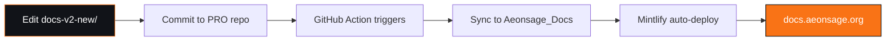

# Documentation Sync Configuration

This directory is **automatically synced** to the [Aeonsage_Docs](https://github.com/velonone/Aeonsage_Docs) repository.

---

## Sync Workflow



---

## How to Update Documentation

### 1. Edit Files Locally
```bash
# Edit documentation in PRO repository
cd c:/path/to/AeonsagePro/docs-v2-new
vim introduction.mdx
```

### 2. Commit & Push
```bash
git add docs-v2-new/
git commit -m "docs: update introduction"
git push origin main
```

### 3. Auto-Sync (Automatic)
- GitHub Action detects changes in `docs-v2-new/`
- Syncs files to Aeonsage_Docs repository
- Mintlify auto-deploys to docs.aeonsage.org (30-60s)

---

## Manual Sync (If Needed)

If GitHub Action fails, manually sync:

```bash
# Clone both repositories
git clone https://github.com/velonone/AeonsagePro.git
git clone https://github.com/velonone/Aeonsage_Docs.git

# Sync files
cd Aeonsage_Docs
rm -rf !(\.git)  # Remove all except .git
cp -r ../AeonsagePro/docs-v2-new/* ./

# Commit and push
git add .
git commit -m "docs: manual sync from PRO repository"
git push
```

---

## GitHub Action Configuration

**File**: `.github/workflows/sync-docs.yml`

**Trigger**: Push to `main` branch with changes in `docs-v2-new/`

**Required Secret**: `DOCS_SYNC_TOKEN`
- Personal Access Token with `repo` scope
- Used to push to Aeonsage_Docs repository

### Setup Secret

1. Generate PAT: https://github.com/settings/tokens
2. Add to PRO repo secrets: `Settings → Secrets → Actions → New repository secret`
3. Name: `DOCS_SYNC_TOKEN`
4. Value: Your PAT

---

## Verification

After pushing documentation changes:

1. **Check GitHub Action**:
   - Go to `Actions` tab in PRO repository
   - Verify "Sync Documentation to Aeonsage_Docs" workflow succeeded

2. **Check Aeonsage_Docs**:
   - Visit https://github.com/velonone/Aeonsage_Docs
   - Verify latest commit is from "AeonSage Docs Bot"

3. **Check Live Site**:
   - Wait 30-60 seconds
   - Visit https://docs.aeonsage.org
   - Verify changes are live

---

## Troubleshooting

### Sync Failed

**Check GitHub Action logs**:
```
Actions → Sync Documentation → View workflow run
```

**Common issues**:
- `DOCS_SYNC_TOKEN` secret missing or invalid
- File permission errors
- Git conflicts

### Changes Not Live

**Mintlify deployment takes 30-60 seconds**

**Check Mintlify dashboard**:
- https://dashboard.mintlify.com
- Verify build succeeded

---

## Repository Links

| Repository | URL |
|------------|-----|
| **PRO** | Private (this repository) |
| **Aeonsage_Docs** | https://github.com/velonone/Aeonsage_Docs |
| **Live Docs** | https://docs.aeonsage.org |
| **OSS** | https://github.com/velonone/Aeonsage |
