# AeonSage Documentation

> **📚 Official Documentation Repository**
> **Repository**: [github.com/velonone/Aeonsage_Docs](https://github.com/velonone/Aeonsage_Docs)
> **Deployed**: [docs.aeonsage.org](https://docs.aeonsage.org)
> **License**: [CC BY 4.0](https://creativecommons.org/licenses/by/4.0/)

This repository contains the official AeonSage documentation, built with [Mintlify](https://mintlify.com) and automatically deployed to docs.aeonsage.org.

---

## About AeonSage

AeonSage is a self-hosted AI orchestration platform that connects language models, messaging channels, and real-world tools. Run entirely on your infrastructure with complete control over your data.

### Platform Architecture


### Editions

```mermaid
graph LR
    subgraph OSS["🌟 OSS Edition (MIT)"]
        O1[Local AI<br/>Ollama/LM Studio]
        O2[Cloud AI BYOK<br/>OpenAI/Claude/Gemini]
        O3[27+ Channels<br/>Telegram/Discord/etc]
        O4[100+ Skills<br/>Extensible]
    end

    subgraph Pro["⭐ Pro Edition ($59/mo)"]
        P1[All OSS Features]
        P2[Cloud Relay<br/>Remote Access]
        P3[Multi-device Sync<br/>Desktop/Mobile]
        P4[VDID Identity<br/>Enterprise Auth]
        P5[Team Management<br/>Advanced Analytics]
    end

    OSS -.Upgrade.-> Pro

    style OSS fill:#111318,stroke:#4ade80,color:#fff
    style Pro fill:#111318,stroke:#F97316,color:#fff
```



**OSS Repository**: [github.com/velonone/Aeonsage](https://github.com/velonone/Aeonsage)

| Feature | OSS | Pro |
|---------|-----|-----|
| Local AI (Ollama) | ✅ Full | ✅ Full |
| Cloud AI (BYOK) | ✅ Full | ✅ Full |
| All Channels (27+) | ✅ Full | ✅ Full |
| Skills System (100+) | ✅ Full | ✅ Full |
| Desktop App | ✅ Full | ✅ Full |
| CLI Tools | ✅ Full | ✅ Full |
| Cloud Relay | ❌ No | ✅ **Yes** |
| Multi-device Sync | ❌ No | ✅ **Yes** |
| VDID Identity | ❌ No | ✅ **Yes** |
| Team Management | ❌ No | ✅ **Yes** |
| Priority Support | ❌ No | ✅ **Yes** |

[Compare Plans](https://aeonsage.org/pricing)

---

## Repository Ecosystem

```mermaid
graph TB
    subgraph "GitHub Repositories"
        OSS[velonone/Aeonsage<br/>🌟 OSS Codebase<br/>MIT License]
        DOCS[velonone/Aeonsage_Docs<br/>📚 Documentation<br/>CC BY 4.0]
        PRO[AeonsagePro<br/>⭐ Pro Codebase<br/>Private]
    end

    subgraph "Deployment"
        SITE[aeonsage.org<br/>Marketing Site]
        DOCSITE[docs.aeonsage.org<br/>Mintlify Docs]
        DASH[aeonsage.org/dashboard<br/>User Dashboard]
    end

    OSS -.Reference.-> DOCS
    PRO -.Reference.-> DOCS
    DOCS --> DOCSITE

    style DOCS fill:#F97316,stroke:#000,color:#fff
    style DOCSITE fill:#111318,stroke:#F97316,color:#fff
    style OSS fill:#111318,stroke:#4ade80,color:#fff
```



### Integration Points

| Repository | Purpose | URL |
|------------|---------|-----|
| **Aeonsage_Docs** | Documentation source | [github.com/velonone/Aeonsage_Docs](https://github.com/velonone/Aeonsage_Docs) |
| **Aeonsage** | OSS codebase | [github.com/velonone/Aeonsage](https://github.com/velonone/Aeonsage) |
| **Deployment** | Live documentation | [docs.aeonsage.org](https://docs.aeonsage.org) |

### Auto-Deployment

```mermaid
sequenceDiagram
    participant DEV as Developer
    participant GH as GitHub (Aeonsage_Docs)
    participant MINT as Mintlify
    participant SITE as docs.aeonsage.org

    DEV->>GH: git push main
    GH->>MINT: Webhook trigger
    MINT->>MINT: Build documentation
    MINT->>SITE: Deploy (30-60s)
    SITE-->>DEV: ✅ Live at docs.aeonsage.org
```



---

## Documentation Structure

```mermaid
graph TB
    ROOT[📚 docs.aeonsage.org]

    ROOT --> GET[🚀 Get Started]
    ROOT --> CONCEPTS[💡 Core Concepts]
    ROOT --> CHAN[📱 Channels]
    ROOT --> PROV[🤖 AI Providers]
    ROOT --> DESK[🖥️ Desktop]
    ROOT --> HOST[🐳 Self-Hosting]
    ROOT --> API[⚡ API Reference]
    ROOT --> SEC[🔒 Security]
    ROOT --> RES[📖 Resources]

    GET --> G1[introduction.mdx]
    GET --> G2[quickstart.mdx]
    GET --> G3[installation.mdx]

    CONCEPTS --> C1[architecture.mdx]
    CONCEPTS --> C2[gateway.mdx]
    CONCEPTS --> C3[channels.mdx]
    CONCEPTS --> C4[ai-providers.mdx]
    CONCEPTS --> C5[skills.mdx]
    CONCEPTS --> C6[workflows.mdx]

    CHAN --> CH1[overview.mdx]
    CHAN --> CH2[telegram.mdx]

    PROV --> P1[ollama.mdx]

    DESK --> D1[installation.mdx]

    HOST --> H1[overview.mdx]
    HOST --> H2[docker.mdx]

    API --> A1[introduction.mdx]

    SEC --> S1[overview.mdx]

    RES --> R1[faq.mdx]
    RES --> R2[changelog.mdx]

    style ROOT fill:#F97316,stroke:#000,color:#fff
    style GET fill:#111318,stroke:#4ade80,color:#fff
    style CONCEPTS fill:#111318,stroke:#4ade80,color:#fff
    style CHAN fill:#111318,stroke:#4ade80,color:#fff
    style PROV fill:#111318,stroke:#4ade80,color:#fff
```



### Directory Tree

```
Aeonsage_Docs/
├── 📄 mint.json              # Mintlify configuration
├── 📄 index.html             # Redirect to /introduction
├── 📄 README.md              # This file
│
├── 🚀 Get Started
│   ├── introduction.mdx
│   ├── quickstart.mdx
│   └── installation.mdx
│
├── 💡 Core Concepts
│   ├── architecture.mdx
│   ├── gateway.mdx
│   ├── channels.mdx
│   ├── ai-providers.mdx
│   ├── skills.mdx
│   ├── workflows.mdx
│   └── ecosystem.mdx
│
├── 📱 Channels (27+ integrations)
│   ├── overview.mdx
│   └── telegram.mdx
│
├── 🤖 AI Providers
│   └── ollama.mdx
│
├── 🖥️ Desktop
│   └── installation.mdx
│
├── 🐳 Self-Hosting
│   ├── overview.mdx
│   └── docker.mdx
│
├── ⚡ API Reference
│   └── introduction.mdx
│
├── 🔒 Security
│   ├── overview.mdx
│   └── configuration/overview.mdx
│
└── 📖 Resources
    ├── faq.mdx
    └── changelog.mdx
```

---

## Development Workflow


### Local Development (Optional)

Mintlify CLI allows local preview:

```bash
# Install Mintlify CLI
npm i -g mintlify

# Start local preview
mintlify dev
```

Open http://localhost:3000

### Adding New Documentation

1. **Create MDX file** in appropriate directory
   ```bash
   # Example: Add new channel guide
   touch channels/whatsapp.mdx
   ```

2. **Update mint.json** navigation
   ```json
   {
     "group": "Channels",
     "pages": [
       "channels/overview",
       "channels/telegram",
       "channels/whatsapp"  // ← Add here
     ]
   }
   ```

3. **Commit and push**
   ```bash
   git add .
   git commit -m "docs: add WhatsApp channel guide"
   git push origin main
   ```

4. **Auto-deploy** (30-60 seconds)
   - Mintlify automatically builds and deploys
   - Check https://docs.aeonsage.org

---

## Writing Guidelines

### Style Guide

- Use clear, concise language
- Write in second person ("you", "your")
- Use sentence case for headings
- Include code examples for technical concepts
- No emojis — professional enterprise style

### Component Reference

```mdx
<!-- Note/Warning/Tip -->
<Note type="info" title="Title">
  Content here
</Note>

<!-- Cards -->
<CardGroup cols={3}>
  <Card title="Title" icon="icon" href="/path">
    Description
  </Card>
</CardGroup>

<!-- Tabs -->
<Tabs>
  <Tab title="Option A">Content A</Tab>
  <Tab title="Option B">Content B</Tab>
</Tabs>

<!-- Code blocks with filename -->
```javascript:filename.js
// code here
```
```

### File Naming

- Use lowercase with hyphens: `my-page.mdx`
- Match the URL path: `/my-page`
- Group related files in directories

---

## Resources

| Resource | Link |
|----------|------|
| GitHub (OSS) | [github.com/velonone/Aeonsage](https://github.com/velonone/Aeonsage) |
| Website | [aeonsage.org](https://aeonsage.org) |
| Pricing | [aeonsage.org/pricing](https://aeonsage.org/pricing) |
| Discord | [discord.gg/aeonsage](https://discord.gg/aeonsage) |

---

## License

Documentation is licensed under [CC BY 4.0](https://creativecommons.org/licenses/by/4.0/).

**Copyright 2026 VelonLabs & The AeonSage Contributors**